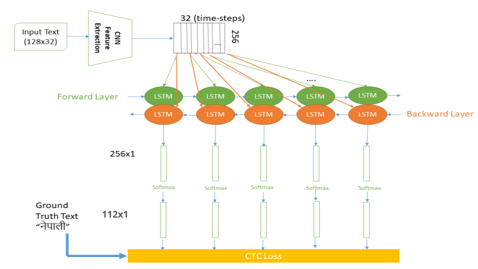
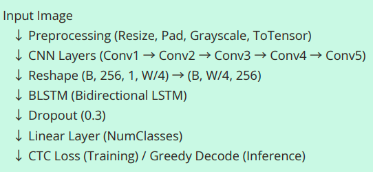
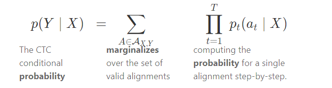
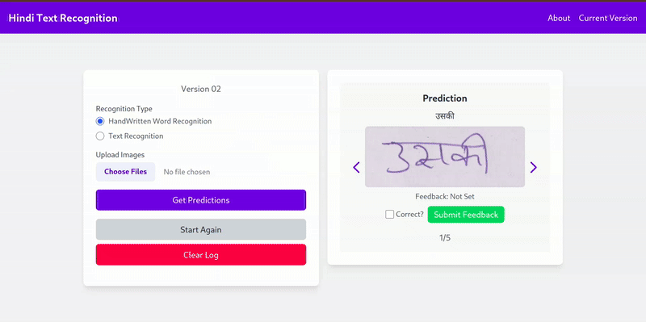
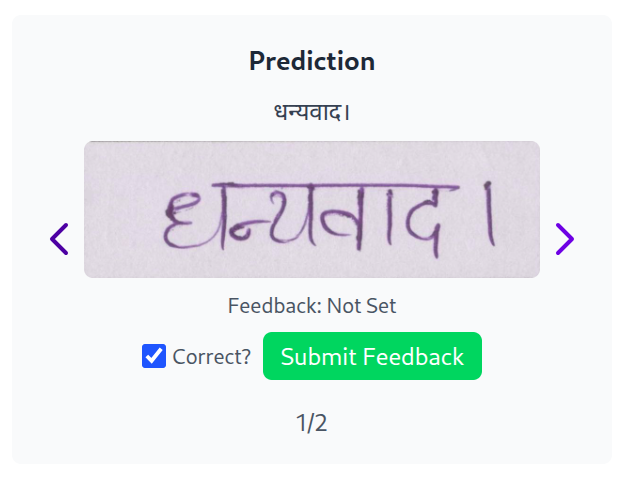

# Hindi Text Recognition Project

## Overview

This project provides a Flask-based web application for recognizing Hindi text from images, supporting both handwritten (HWT) and rendered text. It leverages a CRNN (Convolutional Recurrent Neural Network) model for text recognition, trained on custom datasets (`HindiSeg` for handwritten text and `SplitDataset` for rendered text). The application includes dynamic model selection, automatically choosing the most recent model file based on the date in the filename (e.g., `HWT_recognition_model_20250518.pth` for a model saved on May 18, 2025). If no dated model is found, it falls back to the default model (e.g., `HWT_recognition_model.pth`).

Key features:
- Supports recognition of handwritten Hindi words (HWT) and rendered Hindi text.
- Web interface for uploading images and viewing predictions.
- Dynamic model selection based on the most recent dated model file.
- Logging of predictions with feedback mechanism.
- Training scripts to fine-tune or retrain models on custom datasets.

## Requirements

- Python 3.8+
- PyTorch
- Flask
- torchvision
- PIL (Pillow)
- tqdm
- Other dependencies listed in `requirements.txt`

Install the dependencies using:
```bash
pip install -r requirements.txt
```

## Project Structure
```
project_root/
├── data/
│   └── Datasets for training and testing
├── test/
│   └── Test images for evaluation
├── handwritten_words/
│   └── Sample handwritten Hindi word images
├── rendered_words/
│   └── Sample rendered Hindi text images
├── thankyou/
│   └── Additional test images
├── images/
│   ├── CtcLossFormula.png        # Diagram of the CTC loss formula
│   ├── HindiTextRecognition.png  # Detailed view of the CRNN model
│   ├── flow.png		          # Flow of Model
│   ├── dhanyawaad.png            # ThankYou Prediction
│   └── webapp.gif                # Demonstration of the web app
├── train/
│   ├── HWT_V2_modified.py        # Training script for handwritten Hindi word recognition
│   └── Text_V2_modified.py       # Training script for rendered Hindi text recognition
├── webapp/
|   ├── app.py                    # Main Flask application for the web interface
│   ├── essential/
│   │   └── charlist.txt          # Character list for mapping Hindi characters to indices
│   ├── models/
│   │   └── Trained models stored here
│   ├── recognition_hwt.py        # Inference script for HWT recognition
│   ├── recognition_text.py       # Inference script for rendered text recognition
│   ├── recognition_hcr.py        # Inference script for HCR recognition (placeholder)
│   ├── static/
│   │   ├── logs/
│   │   │   └── predictions.json  # Prediction logs
│   │   └── uploads/
│   │       └── Uploaded images
│   └── templates/
│       ├── index.html            # Main page
│       ├── about.html            # About page
│       └── version.html          # Version page
```


## How It Works

This project enables Hindi text recognition through a combination of a web interface and deep learning models. Here's a step-by-step overview of its working:

1. **Dataset Preparation**: The project uses two datasets: `HindiSeg` for handwritten Hindi words (HWT) and `SplitDataset` for rendered Hindi text. Each dataset contains images of Hindi words along with corresponding labels in `train.txt` and `val.txt` files.

2. **Model Training**: The CRNN model is trained using `train/HWT_V2_modified.py` for HWT and `train/Text_V2_modified.py` for rendered text. The model is trained with CTC (Connectionist Temporal Classification) loss, which allows it to handle variable-length sequences without explicit character segmentation.

3. **Model Saving**: Trained models are saved with a date suffix (e.g., `HWT_recognition_model_20250518.pth`) in the `webapp/essential/models/` directory.

4. **Web Application**:
   - The Flask app (`webapp/app.py`) provides a web interface for users to upload images.
   - The app dynamically selects the most recent model for the chosen recognition type (HWT or rendered text).
   - Uploaded images are preprocessed (resized, padded, and normalized) and passed through the CRNN model for prediction.
   - Predictions are decoded using a greedy CTC decoder and displayed alongside the uploaded images.
   - Users can provide feedback on prediction accuracy, which is logged in `webapp/static/logs/predictions.json`.
5. **Evaluation**: Test images in `data/test/` can be used to evaluate the model’s performance on handwritten and rendered Hindi text.

The overall flow of the architecture is illustrated below:



## Model Information

### Architecture

The project uses a **CRNN (Convolutional Recurrent Neural Network)** model, which combines convolutional layers for feature extraction with recurrent layers for sequence modeling. The architecture is designed to handle variable-length text inputs, making it ideal for text recognition tasks. Below is the detailed structure:

- **CNN Component**:
  - **Conv1**: 1 input channel (grayscale), 64 output channels, 3x3 kernel, padding=1, followed by BatchNorm and ReLU.
  - **MaxPool1**: 2x2 pooling.
  - **Conv2**: 64 input channels, 128 output channels, 3x3 kernel, padding=1, followed by BatchNorm and ReLU.
  - **MaxPool2**: 2x2 pooling.
  - **Conv3**: 128 input channels, 256 output channels, 3x3 kernel, padding=1, followed by BatchNorm and ReLU.
  - **Conv4**: 256 input channels, 256 output channels, 3x3 kernel, padding=1, followed by BatchNorm and ReLU.
  - **Conv5**: 256 input channels, 256 output channels, 9x3 kernel, padding=(0,1), followed by BatchNorm and ReLU.
  - The CNN outputs a feature map of shape (batch_size, channels, height, width), which is squeezed and permuted to (batch_size, width, channels) for the RNN.

- **RNN Component (BLSTM)**:
  - Two bidirectional LSTM layers with 256 input size and 512 hidden size.
  - Processes the sequential features from the CNN, capturing dependencies in the text.

- **Linear Layer**:
  - Maps the BLSTM output (1024 dimensions, due to bidirectional LSTM) to the number of classes (number of characters + 1 for the blank label).
  - A dropout layer (0.3) is applied before the linear layer to prevent overfitting.

- **Output**: The model outputs a sequence of logits for each time step, which are decoded using CTC.

The detailed architecture is visualized below:



### Method

- **Preprocessing**: Images are resized to a fixed height (36 pixels) while preserving the aspect ratio, then padded to a fixed width (128 pixels) with white padding. Data augmentation (random rotation, affine translation, color jitter) is applied during training to improve robustness.
  
- **Training**: The model is trained using the Adam optimizer with a learning rate of 0.0001. CTC loss is used to align the predicted sequence with the ground truth without requiring character-level segmentation. Early stopping is implemented based on validation loss, with a patience parameter to halt training if no improvement is observed.
  
- **Inference**: During inference, the model outputs a sequence of logits, which are decoded using a greedy CTC decoder to produce the final text prediction. The decoder removes blank labels and repeated characters to generate the predicted Hindi text.
  
- **Evaluation**: The model is evaluated on a validation set during training, and accuracy is computed by comparing the predicted text with the ground truth. Random samples are printed after each epoch to monitor performance.

## CRNN and CTC Loss

### CRNN (Convolutional Recurrent Neural Network)

CRNN is a hybrid neural network architecture that combines the strengths of convolutional neural networks (CNNs) and recurrent neural networks (RNNs). It is particularly well-suited for sequence prediction tasks like text recognition, where the input (an image) contains a sequence of characters that need to be predicted.

- **Why CRNN?**: The CNN extracts spatial features from the input image, such as edges and patterns, which are crucial for identifying characters. These features are then fed into an RNN (specifically a bidirectional LSTM in this project), which models the sequential nature of text, capturing dependencies between characters. Finally, a linear layer maps the RNN outputs to character probabilities.
- **In This Project**: The CRNN model processes grayscale images of Hindi text, extracting features through a series of convolutional layers and modeling the sequence with a BLSTM. This allows the model to handle variable-length text without requiring character segmentation.

### CTC Loss (Connectionist Temporal Classification)

CTC loss is a critical component for training models on sequence prediction tasks where the alignment between the input and output sequences is unknown, such as in text recognition.

- **What is CTC?**: CTC loss enables the model to predict a sequence of labels (characters) from an unsegmented input (image) by introducing a "blank" label and allowing multiple possible alignments between the predicted sequence and the ground truth. It computes the probability of all possible alignments and optimizes the model to maximize the likelihood of the correct sequence.
- **How It Works**: During training, the CRNN model outputs a sequence of logits for each time step (width of the feature map). CTC loss aligns these logits with the ground truth text by summing over all possible alignments that collapse to the target sequence after removing blanks and duplicates. The loss is then used to update the model weights.
- **Decoding**: At inference time, a greedy decoder is used to select the most likely character at each time step, removing blanks and duplicates to produce the final prediction.
- **In This Project**: CTC loss is used to train the CRNN model on Hindi text, allowing it to predict sequences of characters without requiring explicit character segmentation. The formula for CTC loss is illustrated below:



## Training

You can train the CRNN models for handwritten (HWT) or rendered text recognition using the provided training scripts in the `train/` directory. The models are saved with a date suffix in the format `<model_name>_<YYYYMMDD>.pth` (e.g., `HWT_recognition_model_20250518.pth`). The training scripts use early stopping based on validation loss and save the model only when a new best accuracy is achieved.

### Training Handwritten Hindi Word Recognition (HWT)

Use `train/HWT_V2_modified.py` to train the model for handwritten Hindi words. The dataset is expected in the `data/HindiSeg/` directory with `train.txt` and `val.txt` files.

**CLI Usage:**
```bash
python train/HWT_V2_modified.py --epochs <num_epochs> --patience <patience> --save_path <path_to_save_model>
```

- `--epochs`: Number of epochs to train (default: 50).
- `--patience`: Number of epochs to wait for improvement before early stopping (default: 5).
- `--save_path`: Directory to save the trained model (default: `webapp/essential/models/`).

**Example:**
```bash
python train/HWT_V2_modified.py --epochs 30 --patience 3 --save_path ./webapp/essential/models/
```
This will train the HWT model for 30 epochs, with early stopping if validation loss doesn’t improve for 3 epochs. The model will be saved as `HWT_recognition_model_<current_date>.pth` (e.g., `HWT_recognition_model_20250518.pth`) in the specified directory.

### Training Rendered Hindi Text Recognition

Use `train/Text_V2_modified.py` to train the model for rendered Hindi text. The dataset is expected in the `data/SplitDataset/` directory with `train.txt` and `val.txt` files.

**CLI Usage:**
```bash
python train/Text_V2_modified.py --epochs <num_epochs> --patience <patience> --save_path <path_to_save_model>
```

- `--epochs`: Number of epochs to train (default: 25).
- `--patience`: Number of epochs to wait for improvement before early stopping (default: 5).
- `--save_path`: Directory to save the trained model (default: `webapp/essential/models/`).

**Example:**
```bash
python train/Text_V2_modified.py --epochs 20 --patience 4 --save_path ./webapp/essential/models/
```
This will train the rendered text model for 20 epochs, with early stopping if validation loss doesn’t improve for 4 epochs. The model will be saved as `Text_recognition_model_<current_date>.pth` (e.g., `Text_recognition_model_20250518.pth`) in the specified directory.

## Dataset Directory Structure

This section details the structure of the datasets used for training and evaluating the Hindi Text Recognition models.

### Handwritten Rendered Text Recognition Dataset (Text)

This dataset was created synthetically using Pillow to render Hindi words in various Devanagari fonts.

```
data/SplitDataset/
├── charlist.txt         (Unique Devanagari characters for mapping)
├── full.txt            (All image paths and labels across splits)
├── hindi_vocab.txt     (List of unique Hindi words in the dataset)
├── lexicon.txt         (Curated list of common Hindi words for decoding)
├── test/               (Test images)
├── test.txt            (Test image paths and labels)
├── train/              (Training images)
├── train.txt           (Training image paths and labels)
├── val/                (Validation images)
└── val.txt             (Validation image paths and labels)
```

- `charlist.txt`: Contains the unique Devanagari characters used in the dataset, for mapping characters to indices.
- `full.txt`: Lists all image paths and their corresponding labels across all splits (train, validation, test).
- `hindi_vocab.txt`: Contains a list of unique Hindi words present in the dataset, useful for vocabulary analysis.
- `lexicon.txt`: A curated list of common Hindi words, which can be used for lexicon-based decoding to improve prediction accuracy.
- `test/`, `train/`, `val/`: Directories containing the test, training, and validation images, respectively.
- `test.txt`, `train.txt`, `val.txt`: Text files listing the image paths and their corresponding labels for each split.


### Handwritten Hindi Words Dataset (HWT)

This dataset is the IIT Devanagari Word Dataset (Version 1), containing handwritten Hindi words from various writers.

```
data/HindiSeg/
├── charlist.txt         (Unique Devanagari characters for mapping)
├── hindi_vocab.txt     (List of unique Hindi words in the dataset)
├── lexicon.txt         (Curated list of common Hindi words for decoding)
├── test/
│   ├── 11/             (Test images from writer 11)
│   ├── 6/              (Test images from writer 6)
│   └── 9/              (Test images from writer 9)
├── test.txt            (Test image paths and labels)
├── train/
│   ├── 1/              (Training images from writer 1)
│   ├── 10/             (Training images from writer 10)
│   ├── 2/              (Training images from writer 2)
│   ├── 4/              (Training images from writer 4)
│   ├── 5/              (Training images from writer 5)
│   ├── 7/              (Training images from writer 7)
│   └── 8/              (Training images from writer 8)
├── train.txt           (Training image paths and labels)
├── val/
│   ├── 12/             (Validation images from writer 12)
│   └── 3/              (Validation images from writer 3)
└── val.txt             (Validation image paths and labels)
```

- `charlist.txt`: Contains the unique Devanagari characters used in the dataset, for mapping characters to indices.
- `hindi_vocab.txt`: Contains a list of unique Hindi words present in the dataset, useful for vocabulary analysis.
- `lexicon.txt`: A curated list of common Hindi words, which can be used for lexicon-based decoding to improve prediction accuracy.
- `test/`, `train/`, `val/`: Directories containing the test, training, and validation images, respectively. Images are organized by writer ID (e.g., `1/`, `11/`) to separate contributions from different writers.
- `test.txt`, `train.txt`, `val.txt`: Text files listing the image paths and their corresponding labels for each split.

## Dataset Preparation

### Handwritten Hindi Words (HWT)

- Place your dataset in the `data/HindiSeg/` directory with the structure described above.
- Ensure `train.txt` and `val.txt` contain lines in the format: `image_path label` (e.g., `train/1/0001.jpg नमस्ते`).
- Ensure `webapp/essential/charlist.txt` contains all possible characters in the dataset. If using the provided dataset, the `charlist.txt` in `data/HindiSeg/` can be copied to `webapp/essential/`.
- Optionally, use `hindi_vocab.txt` and `lexicon.txt` for vocabulary analysis or lexicon-based decoding to improve prediction accuracy.

### Rendered Hindi Text

- Place your dataset in the `data/SplitDataset/` directory with the structure described above.
- Ensure `train.txt` and `val.txt` contain lines in the format: `image_path label` (e.g., `train/0001.png नमस्ते`).
- Ensure `webapp/essential/charlist.txt` contains all possible characters in the dataset. If using the provided dataset, the `charlist.txt` in `data/SplitDataset/` can be copied to `webapp/essential/`.
- Optionally, use `hindi_vocab.txt` and `lexicon.txt` for vocabulary analysis or lexicon-based decoding to improve prediction accuracy.

## Usage

### Running the Web Application

1. Ensure the trained models are in the `webapp/essential/models/` directory.
2. Navigate to the `webapp/` directory and run the Flask app:
   ```bash
   cd webapp
   python app.py
   ```
3. Open your browser and navigate to `http://localhost:5000`.

### Web Interface

- **Select Recognition Type**: Choose between `hwt` (handwritten) or `text` (rendered text) from the dropdown.
- **Upload Images**: Upload one or more images (PNG, JPG, JPEG) to get predictions.
- **View Predictions**: Predictions are displayed alongside the uploaded images.
- **Provide Feedback**: Mark predictions as correct or incorrect, which updates the log.
- **View Logs**: Prediction history is displayed at the bottom of the page.
- **Clear Logs**: Use the "Clear Logs" button to reset the prediction history.

The app automatically selects the most recent model file for the chosen recognition type (e.g., `HWT_recognition_model_20250518.pth` if it exists and is the most recent). If no dated model is found, it falls back to the default model (e.g., `HWT_recognition_model.pth`).

## Demo

Below is a demonstration of the web app in action, showcasing the process of uploading images, selecting the recognition type, and viewing predictions:



## Notes

- Models are saved with a date suffix (e.g., `HWT_recognition_model_20250518.pth`) to indicate the training date. The Flask app automatically selects the most recent model based on this date.
- The web app stores uploaded images in `webapp/static/uploads/` and clears them on shutdown.
- Prediction logs are stored in `webapp/static/logs/predictions.json` and can be cleared via the web interface.
- Test images are provided in `data/test/` for evaluating the models on handwritten words, rendered words, and additional samples (`thankyou`).

## References

The following resources were instrumental in shaping our approach to Hindi Text Recognition:

- **Devnagari Handwritten Word Recognition**: A GitHub repository implementing CRNN with CTC loss for Devanagari text, providing practical code for Hindi HTR. [Link](https://github.com/sushant097/Devnagari-Handwritten-Word-Recongition-with-Deep-Learning)
- **SimpleHTR**: A TensorFlow-based HTR system for English, offering insights into CTC implementation and decoding techniques. [Link](https://github.com/githubharald/SimpleHTR)
- **Handwritten Text Recognition in Historical Documents**: A thesis exploring HTR with CTC, relevant for understanding complex script recognition. [Link](https://repositum.tuwien.ac.at/obvutwhs/download/pdf/2874742)
- **Word Beam Search**: A paper proposing an advanced CTC decoding algorithm, useful for improving prediction accuracy. [Link](https://repositum.tuwien.ac.at/obvutwoa/download/pdf/2774578)

## Contributing

Feel free to fork this repository, make improvements, and submit pull requests. For major changes, please open an issue first to discuss your ideas.

## License

This project is licensed under the MIT License.



